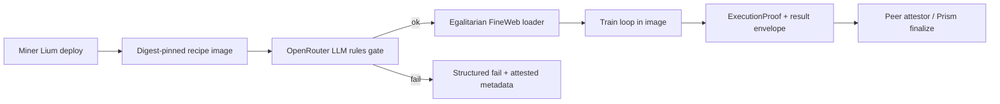

<div align="center">

# PRISM Recipe

**Image-sealed PRISM training recipe: egalitarian FineWeb-Edu window, OpenRouter rules gate, and attested miner runtime.**

<a href="docs/miner/README.md">Miners</a> ·
<a href="docs/architecture.md">Architecture</a> ·
<a href="docs/security.md">Security</a>

[](LICENSE)
[](https://bittensor.com/)
[](https://joinbase.ai)
[](https://joinbase.ai)
[](https://chain.joinbase.ai/health)

</div>

---

## Overview

**prism-recipe** is the miner-deployable runtime for the PRISM recipe product path on
[BASE](https://joinbase.ai). Architecture, training loop, data loader, rules gate, and
harness live **inside a digest-pinned container image**. There is **no separate miner ZIP
submit path** for this product: miners deploy the recipe image and supply environment only
(`OPENROUTER_API_KEY` plus Lium / Base worker deploy settings).

Every architecture sees the same **egalitarian** FineWeb-Edu token window: fixed dataset
identity and revision, fixed global token start offset, production
`token_budget=2_500_000_000`, **single pass** (one epoch). Smoke and CI may shrink budget
via `PRISM_RECIPE_TOKEN_BUDGET` without changing the offset pin identity.

Before training starts, an **OpenRouter LLM rules gate** checks code against image-bundled
`.rules/`. The gate decision and `rules_digest` are intended for ExecutionProof /
worker-result metadata so peers and Prism finalize can audit that the gate ran.

Master coordination remains off the miner GPU path (no master-hosted PRISM GPU eval for this
product). Scoring and attestation follow the dual-worker peer path on the live worker plane.

## Architecture



## How it works

1. **Build / pin** the recipe image and record its content digest.
2. **Deploy** on Lium (or equivalent) with miner hotkey binding and master URL.
3. **Inject** `OPENROUTER_API_KEY` (and host-side Lium credentials; never bake secrets).
4. **Preflight** runs the LLM gate against bundled `.rules/` (structured JSON outcome).
5. **Load** the egalitarian FineWeb-Edu window (fixed offset; prod 2.5B tokens, 1 pass).
6. **Train** inside the image (architecture + harness sealed; no miner ZIP swap).
7. **Attest** with full worker envelope (`run_manifest`, proof, gate metadata, image digest).
8. **Score** via dual miner-bound workers + peer path; public submission reaches a terminal score state.

## Product model (what miners supply)

| Concern | Owner |
| --- | --- |
| Architecture + training + harness | **Recipe image** (this repo) |
| Egalitarian data window pin | **Recipe image** |
| OpenRouter rules gate + `.rules/` | **Recipe image** |
| `OPENROUTER_API_KEY` | **Miner env** at deploy time |
| Lium / worker deploy credentials | **Miner host env** (not in image) |
| Separate architecture ZIP submit | **Not used** for this product path |

## Documentation

| Audience | Guide | Contents |
| --- | --- | --- |
| Miners | [docs/miner/README.md](docs/miner/README.md) | Deploy env, image pin, preflight, attestation notes |
| Engineers | [docs/architecture.md](docs/architecture.md) | Flows, package layout, pins |
| Security | [docs/security.md](docs/security.md) | Secrets, residual risk |

## Quick start (local scaffold)

```bash
# clone
git clone https://github.com/BaseIntelligence/prism-recipe.git
cd prism-recipe

# install
python -m venv .venv
source .venv/bin/activate
pip install -e ".[dev]"

# smoke unit tests (no network required for scaffold)
pytest -q

# rules digest + structured preflight (fails structured if key missing)
prism-recipe rules-digest
prism-recipe preflight
```

Copy [`.env.example`](.env.example) for local env naming only. Do not commit real keys.

### Docker (CPU smoke twin + CUDA)

```bash
# CPU smoke twin (CI / local) — builds, runs offline tiny-1m smoke in-image
docker build -t prism-recipe:local .
docker image inspect prism-recipe:local --format '{{.Id}}' | tee .docs-evidence/IMAGE_ID.txt
docker run --rm \
  -e PRISM_RECIPE_SMOKE=1 \
  -e PRISM_RECIPE_SMOKE_SKIP_GATE=1 \
  -e PRISM_RECIPE_TOKEN_BUDGET=256 \
  prism-recipe:local smoke --skip-gate

# CUDA variant (miner GPU hosts)
docker build -f Dockerfile.cuda -t prism-recipe:cuda .
```

Record the image Id / registry content digest after build for miner pin documentation.
See [docs/miner/README.md](docs/miner/README.md) for deploy env (`OPENROUTER_API_KEY`,
host `LIUM_API_KEY`, master URL, hotkey binding).

## Configuration pins

| Pin | Value |
| --- | --- |
| Dataset | `HuggingFaceFW/fineweb-edu` |
| Revision (immutable commit) | `87f09149ef4734204d70ed1d046ddc9ca3f2b8f9` |
| `EQUAL_OFFSET` (global token start) | `0` (documented; shared by all arches) |
| `TOKEN_BUDGET_PROD` | `2_500_000_000` |
| Epochs / pass | `1` (single-pass; multi-epoch rescan forbidden) |
| Smoke override | `PRISM_RECIPE_TOKEN_BUDGET` (budget only; offset identity unchanged) |
| Master FineWeb mount | **Not required** — workers load HF / cached shards themselves |
| Default OpenRouter model | `x-ai/grok-4.5` (pinned request model) |
| Rules tree | `.rules/*.md` (immutable in image) |
| Gate attestation | `rules_digest`, `model`, `decision`, `checked_at`, `prompt_hash` |

## Repository layout

```text
prism-recipe/
  .rules/                 # training compliance (LLM gate input)
  src/prism_recipe/       # config, loader, llm_gate, arch/tiny_1m, smoke_train, harness, cli
  tests/                  # unit + offline + smoke train tests
  docs/                   # miner + architecture + security
  Dockerfile              # CPU smoke twin (digest pin)
  Dockerfile.cuda         # CUDA miner variant
  pyproject.toml
  LICENSE                 # Apache-2.0
```

## Status

Scaffold + egalitarian FineWeb-Edu loader + OpenRouter LLM rules gate + **digest-pinned
image** (CPU twin + CUDA Dockerfile) + **transformer-tiny-1m offline smoke train** under
small `token_budget` (mocked HF fixture). Live dual-Lium score path is a follow-on feature.
Production 2.5B train is a **config pin**, not a required live long GPU run for engineering
smoke.

## Miner navigation map (BASE recipes)

| Repo | Use when |
| --- | --- |
| [prism-recipe](https://github.com/BaseIntelligence/prism-recipe) (this repo) | Mining **PRISM** (digest-pinned train image + Lium / worker-plane GPU attestation) |
| [agent-recipe](https://github.com/BaseIntelligence/agent-recipe) | Mining **agent-challenge** (agent ZIP + Phala TDX attestation) |
| [agent-challenge](https://github.com/BaseIntelligence/agent-challenge) | Challenge service, submit scripts, full selfdeploy implementation |
| [baseagent](https://github.com/BaseIntelligence/baseagent) | Upstream agent template only (sync source for agent-recipe) |

These two recipe repos are the miner day-1 product surfaces: **prism-recipe** for PRISM and
**agent-recipe** for agent-challenge.

## License

Apache License 2.0. See [LICENSE](LICENSE).
