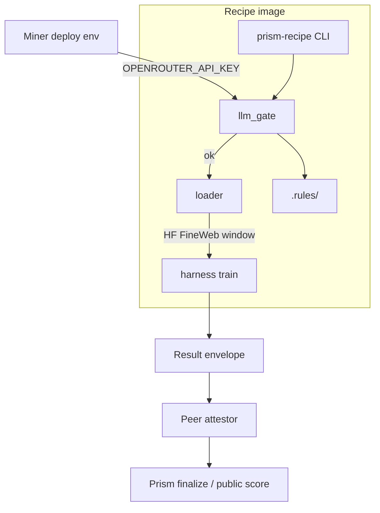

# Architecture

## Intent

`prism-recipe` packages the PRISM **recipe product** as a single digest-pinned image:

1. Pre-train **OpenRouter LLM rules gate** (miner-provided key, image-bundled rules).
2. **Egalitarian** FineWeb-Edu token window (fixed offset, prod 2.5B tokens, one pass).
3. **Train loop** with architecture and training code sealed in the image.
4. **Attestation** metadata for worker results / ExecutionProof (gate + digests).

Master services coordinate and finalize scores. They do not host PRISM GPU eval for this path.

## Flow

## Package map

| Module | Role |
| --- | --- |
| `prism_recipe.config` | Prod pins + smoke budget resolve |
| `prism_recipe.loader` | Egalitarian FineWeb loader (stub → full impl later) |
| `prism_recipe.llm_gate` | Rules digest + gate result shape (OpenRouter later) |
| `prism_recipe.harness` | Preflight / train orchestration stubs |
| `prism_recipe.cli` | `preflight`, `train`, `rules-digest` |

## Data window identity

Pin identity is `(dataset_id, dataset_revision, token_start_offset)`. Production sets
`token_budget=2_500_000_000` and `epochs=1`. Smoke may lower budget only.

## Trust boundaries

- **In image:** harness, rules, architecture/training for this product, loader code.
- **Miner env:** `OPENROUTER_API_KEY`, Lium API key on the **host**, wallet/hotkey ops.
- **Out of band:** chain API (`chain.joinbase.ai`), OpenRouter, Hugging Face hubs/caches.

## Related BASE surfaces

- Public PRISM challenge UI and master API remain on BASE / `chain.joinbase.ai`.
- Classic two-script ZIP submit is a **different** product path; recipe image supersedes
  ZIP-only submit for this slice.
