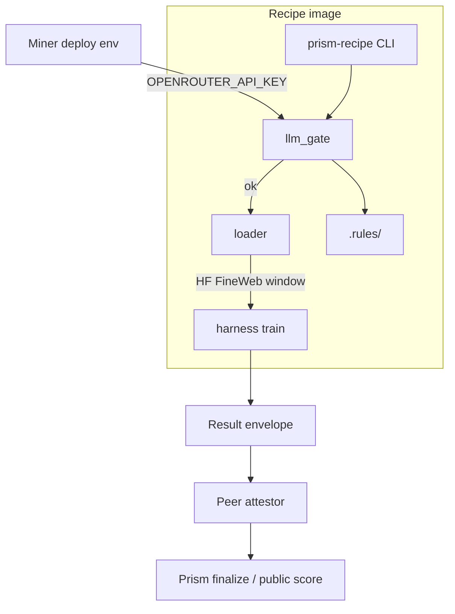

# Architecture

## Intent

`prism-recipe` packages the PRISM **recipe product** as a single digest-pinned image:

1. Pre-train **OpenRouter LLM rules gate** (miner-provided key, image-bundled rules).
2. **Egalitarian** FineWeb-Edu token window (fixed offset, prod 2.5B tokens, one pass).
3. **Train loop** with architecture and training code sealed in the image.
4. **Attestation** metadata for worker results / ExecutionProof (gate + digests).

Master services coordinate and finalize scores. They do not host PRISM GPU eval for this path.

## Flow

## Package map

| Module | Role |
| --- | --- |
| `prism_recipe.config` | Prod pins + smoke budget resolve |
| `prism_recipe.loader` | Egalitarian FineWeb loader (offset + budget, single-pass) |
| `prism_recipe.llm_gate` | OpenRouter rules gate + attestation metadata |
| `prism_recipe.arch.tiny_1m` | Sealed transformer-tiny-1m (≤1.5M params) |
| `prism_recipe.smoke_train` | Offline fixture HF + tiny-1m train steps |
| `prism_recipe.harness` | Preflight / smoke train / train orchestration |
| `prism_recipe.cli` | `preflight`, `train`, `smoke`, `rules-digest` |

## Image seal (VAL-RECIPE-005)

| Artifact | Role |
| --- | --- |
| `Dockerfile` | CPU smoke twin (CI / local digest pin) |
| `Dockerfile.cuda` | CUDA preferred base for miner GPU deploys |
| `.rules/` | Immutable LLM gate input |
| `src/prism_recipe/**` | Harness, loader, gate, sealed arch |

`mid_run_miner_mutation=false`: miners cannot swap harness/rules/arch at runtime without
breaking the digest pin. Secrets stay out of layers (`OPENROUTER_API_KEY` at runtime;
`LIUM_API_KEY` host-only).

## Data window identity

Pin identity is `(dataset_id, dataset_revision, token_start_offset)`. Production sets
`TOKEN_BUDGET_PROD = token_budget = 2_500_000_000` and `epochs = 1` (single-pass).
Smoke may lower budget only via `PRISM_RECIPE_TOKEN_BUDGET`.

| Constant | Value | Notes |
| --- | --- | --- |
| `PROD_DATASET_ID` | `HuggingFaceFW/fineweb-edu` | Same for all arches |
| `PROD_DATASET_REVISION` | `87f09149ef4734204d70ed1d046ddc9ca3f2b8f9` | Immutable commit SHA (not a moving tag) |
| `EQUAL_OFFSET` / `PROD_TOKEN_START_OFFSET` | `0` | Global token start; identical for every architecture |
| `TOKEN_BUDGET_PROD` | `2_500_000_000` | Prod pin only; long 2.5B GPU train not required for smoke |
| `PROD_EPOCHS` | `1` | Single-pass; multi-epoch rescan is rejected |

### Worker data plane (no master FineWeb mount)

Workers load FineWeb-Edu (or HF/local caches) **themselves** through the recipe loader.
A live master FineWeb filesystem mount is **not** required for this product path. Unit
tests inject a mocked/tiny document stream to prove offset + budget stop without network.

## Trust boundaries

- **In image:** harness, rules, architecture/training for this product, loader code.
- **Miner env:** `OPENROUTER_API_KEY`, Lium API key on the **host**, wallet/hotkey ops.
- **Out of band:** chain API (`chain.joinbase.ai`), OpenRouter, Hugging Face hubs/caches.
- **Not required:** master-hosted `/data/fineweb-edu` mount for recipe workers.

## Related BASE surfaces

- Public PRISM challenge UI and master API remain on BASE / `chain.joinbase.ai`.
- Classic two-script ZIP submit is a **different** product path; recipe image supersedes
  ZIP-only submit for this slice.
